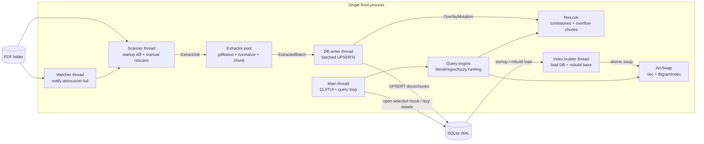

# MVP Architecture for a Durable PDF Folder Search Tool

## Executive summary

The cleanest one-week MVP is an **in-process Rust application** with **SQLite as the durable extracted-text store** and a **fff-style in-memory search index** built over PDF pages or sub-page chunks. That composition matches how the two upstream systems actually divide labor: **fff** keeps its hot search structures in memory, builds them in background threads, and applies live mutations through an overlay; **rga** delegates PDF extraction to Poppler’s `pdftotext`, normalizes the output, and persists extracted text in SQLite instead of re-extracting on every run. citeturn40view5turn31view1turn9view0turn32view3turn25view0turn18view1turn25view3turn24view0turn24view2turn19search3

The **database ends at durability**. It stores document metadata, extracted page/chunk text, and extraction-version metadata so unchanged PDFs are not reprocessed. **Searching starts after startup load**, when the process reads active chunks from SQLite into `ChunkItem` records, builds an in-memory dense bigram index plus a small mutation overlay, and answers queries from memory. SQLite is therefore not the query engine in the MVP; it is the persistent source for rebuilding the live index and for surviving restarts. That boundary is the shortest path to “durable + fast + understandable.” The choice of SQLite is also consistent with rga’s move to SQLite “for inspectability and robustness,” while fff keeps LMDB via `heed` only for small persistent metadata such as frecency and query history. citeturn19search3turn24view0turn27view0turn28view1turn29view2

Use **neo_frizbee** as the only fuzzy scorer in the MVP. That is what fff already uses in its hot path, and the crate is explicitly designed for SIMD, typo-resistant, parallel fuzzy matching. Do **not** bring in `nucleo-matcher` for week one: its own docs warn that using the low-level matcher directly in a UI loop is slow and recommend the higher-level `nucleo` crate for large interactive pickers. For this tool, fuzzy scoring should be a **ranking step over an already small candidate set**, not the primary search method over all chunks. citeturn12view1turn14view1turn39search0turn39search1

No daemon is required. The default mode should be a normal CLI/TUI process that starts, opens SQLite, loads/builds the base index, starts an optional watcher, and exits cleanly when the user quits. Optional daemonization later is straightforward because the core pieces are already process-internal services with clear channels and atomic state publication. fff itself follows this pattern: `new_with_shared_state` installs a shared picker, spawns a background scan job, and optionally starts a watcher; it is not a separate always-on system daemon. citeturn40view5turn31view1turn8view4turn11view2

## Authoritative sources

The sources below are the minimum set worth reading before implementing.

| Source | Why it matters |
|---|---|
| **fff repository / core lifecycle docs** — `file_picker.rs` and crate docs. citeturn40view5turn27view0 | Establishes fff’s real architecture: background scan, in-process watcher, shared read/write access, and search entry points. |
| **fff bigram index** — `bigram_filter.rs`. citeturn9view0turn9view2turn9view3turn32view3 | Shows the exact dense bigram structure, skip-1 sub-index, overlay model, and the memory constraints that matter for a chunk corpus. |
| **fff regex/fuzzy bigram query** — `bigram_query.rs`. citeturn36view1turn38view0turn38view1 | Gives the exact AND/OR query-tree evaluation, regex-to-bigram decomposition, and the fuzzy probe strategy. |
| **fff scanning and watcher** — `scan.rs`, `background_watcher.rs`, `shared.rs`. citeturn11view2turn11view3turn31view2turn28view8 | Defines threading, debounce behavior, lock boundaries, and how base index rebuilds and overlays interact. |
| **fff ranking / scorer integration** — `score.rs`, `frecency.rs`, `query_tracker.rs`. citeturn12view1turn14view0turn13view1turn29view1turn29view2 | Shows how fff uses `neo_frizbee`, plus persistent frecency and query-history bonus logic if you later want result personalization. |
| **rga README and built-in adapters** — README, `custom.rs`, `postproc.rs`. citeturn15search5turn18view1turn25view3turn42view0 | The authoritative description of how rga extracts PDFs: Poppler `pdftotext`, then page-break postprocessing and text decoding/binary handling. |
| **rga preprocessing and cache** — `preproc.rs`, `matching.rs`, `preproc_cache.rs`, `caching_writer.rs`. citeturn25view0turn25view2turn22view2turn24view0turn24view2 | Explains adapter selection, recursive preprocessing design, and why SQLite + compressed cache is used in practice. |
| **rga release notes** — SQLite / async architecture change. citeturn19search3 | Confirms that upstream moved cache persistence to SQLite “for inspectability and robustness” and shifted the code base to async. |
| **neo_frizbee docs**. citeturn39search0turn39search2 | Primary source for the scorer fff already uses. |
| **nucleo / nucleo-matcher docs**. citeturn39search1turn39search19 | Primary source for the alternative scorer, and the reason not to choose it for this MVP. |

## Architecture

FFF’s relevant lesson is not “copy the entire file picker.” It is this: **keep a hot, immutable-ish base index in memory; apply live changes through a small overlay; rebuild the base out of band; swap atomically**. RGA’s relevant lesson is equally narrow: **for PDFs, the extraction path can be very simple — Poppler text extraction, page-break decoding, optional SQLite caching**. The MVP below composes only those useful pieces. citeturn32view3turn31view2turn25view0turn18view1turn25view3turn24view0



The important boundary is simple:

| Concern | Owner |
|---|---|
| Persistence across restarts | SQLite |
| Fast candidate generation | in-memory `BigramIndex` |
| Live changes between rebuilds | `Overlay` |
| Exact verification and preview extraction | query thread over `ChunkItem.text_utf8` / `text_norm_ascii` |
| PDF extraction | extractor worker pool calling Poppler |

That boundary keeps the system minimal and explainable. It also avoids the common mistake of “just dumping chunks into a DB and hoping the DB is the search engine.” In this design, the DB is durable storage; the hot path is the in-memory index and overlay.

## Data model

### SQLite schema

This is the minimum durable schema I recommend for week one.

```sql
PRAGMA journal_mode = WAL;
PRAGMA synchronous = NORMAL;
PRAGMA foreign_keys = ON;
PRAGMA temp_store = MEMORY;

CREATE TABLE IF NOT EXISTS meta (
  key TEXT PRIMARY KEY,
  value TEXT NOT NULL
);

CREATE TABLE IF NOT EXISTS documents (
  doc_id              INTEGER PRIMARY KEY,
  path                TEXT NOT NULL UNIQUE,
  size_bytes          INTEGER NOT NULL,
  mtime_ns            INTEGER NOT NULL,
  dev                 INTEGER,
  ino                 INTEGER,
  extractor           TEXT NOT NULL,          -- e.g. "pdftotext"
  extractor_version   TEXT NOT NULL,          -- poppler version string or tool sig
  norm_version        INTEGER NOT NULL,       -- bump when normalization changes
  page_count          INTEGER NOT NULL DEFAULT 0,
  status              TEXT NOT NULL,          -- ok | empty | error | deleted
  error_text          TEXT,
  indexed_at_ms       INTEGER NOT NULL,
  deleted_at_ms       INTEGER
);

CREATE TABLE IF NOT EXISTS chunks (
  chunk_id            INTEGER PRIMARY KEY,
  doc_id              INTEGER NOT NULL REFERENCES documents(doc_id) ON DELETE CASCADE,
  page_no             INTEGER NOT NULL,
  chunk_ord           INTEGER NOT NULL,
  char_start          INTEGER NOT NULL,
  char_end            INTEGER NOT NULL,
  text_utf8           TEXT NOT NULL,          -- display / preview / exact regex
  text_norm_ascii     TEXT NOT NULL,          -- lowercased + whitespace-collapsed + deunicoded
  preview             TEXT NOT NULL,          -- cheap startup/UI default
  active              INTEGER NOT NULL DEFAULT 1,
  UNIQUE(doc_id, page_no, chunk_ord)
);

CREATE INDEX IF NOT EXISTS idx_documents_status_path
  ON documents(status, path);

CREATE INDEX IF NOT EXISTS idx_chunks_doc_ord
  ON chunks(doc_id, chunk_ord);

CREATE INDEX IF NOT EXISTS idx_chunks_doc_page
  ON chunks(doc_id, page_no, chunk_ord);
```

Why this shape:

- `documents` stores the **re-extraction contract**: file identity, extractor version, normalization version, and error state.
- `chunks` stores both **display text** and **search normalization text** so startup does not have to redo expensive normalization.
- There is **no FTS5 table** in the MVP. Querying SQLite is not the hot path.
- There is **no persisted bigram table** in week one. On startup, rebuild the dense in-memory index from `chunks.text_norm_ascii`. That mirrors rga’s “persist extracted text” idea and fff’s “search in memory” idea.

### In-memory structures

```rust
struct ChunkItem {
    chunk_id: i64,
    doc_id: i64,
    path: Arc<str>,
    filename: Arc<str>,
    page_no: u32,
    chunk_ord: u32,
    char_start: u32,
    char_end: u32,
    text_utf8: Arc<str>,
    text_norm_ascii: Arc<[u8]>,
    preview: Arc<str>,
    doc_mtime_ns: i64,
}

struct BaseIndex {
    chunks: Arc<Vec<ChunkItem>>,
    doc_ranges: HashMap<i64, std::ops::Range<usize>>, // doc_id -> base chunk range
    bigrams: Arc<BigramIndex>,
    built_at_ms: i64,
}

struct BigramIndex {
    lookup: Vec<u16>,          // 65536 entries: bigram key -> dense column or NO_COLUMN
    dense_data: Vec<u64>,      // fixed-stride bitsets, exactly like fff
    dense_count: usize,
    words: usize,
    item_count: usize,
    populated: usize,
    skip_index: Option<Box<BigramIndex>>,
}

struct Overlay {
    tombstones: Vec<u64>,                   // hide stale base chunks
    overflow_chunks: Vec<ChunkItem>,        // new/changed chunks since last rebuild
    overflow_bigrams: Vec<Vec<u16>>,        // deduped bigrams per overflow chunk
    changed_docs: HashSet<i64>,
    generation: u64,
}
```

The exact inspiration from fff is the **base + overlay** split. fff’s `BigramOverlay` stores per-item modified bigram sets and a tombstone bitset so mutations are visible immediately while the dense base index remains unchanged until rebuild. That is the right pattern here too. citeturn32view3turn31view2

## Concurrency and algorithms

### Threading model

FFF explicitly separates background scanning/indexing work from read-heavy search, using a dedicated Rayon pool for expensive background work and light lock contention around shared state. Its watcher owns a debouncer, owner thread, and mpsc channel, and its shared picker is guarded by `parking_lot::RwLock`. The MVP should preserve those same boundaries, but with SQLite replacing fff’s path-only state as the durable store. citeturn31view0turn8view4turn11view2turn28view8

| Component | Count | Responsibility | Sync / IPC | Expected latency |
|---|---:|---|---|---|
| Main thread | 1 | CLI/TUI, parses query, runs search, renders results | Reads `ArcSwap<BaseIndex>`, read-locks `Overlay` | warm query: target 5–50 ms |
| Scanner | 1 | Startup walk; compares filesystem against `documents`; enqueues extraction and delete jobs | `flume` / `crossbeam_channel` bounded queue | startup diff: seconds to minutes depending on corpus size |
| Watcher | 1 | Debounced file events; forwards dirty paths to scanner | `notify-debouncer-full`, channel | 50–250 ms debounce + downstream extraction |
| Extractor pool | `min(cores-2, 6)` | `pdftotext`, UTF-8 normalization, page split, chunking, per-chunk bigram extraction | bounded work queue; result queue to DB writer | tens to hundreds of ms per PDF |
| DB writer | 1 | Owns SQLite writer connection; batched UPSERT / tombstone / delete transactions | single-writer queue | 1–20 ms per transaction batch |
| Index builder | 1 | Loads active chunks from SQLite, rebuilds dense base index, atomically swaps `BaseIndex` | `ArcSwap`, rebuild trigger channel | background seconds; no query stall |

**Synchronization primitives**

- `ArcSwap<BaseIndex>` for atomic pointer swaps of the whole base index.
- `parking_lot::RwLock<Overlay>` for a tiny mutable overlay.
- `flume::bounded` or `crossbeam_channel::bounded` for `ExtractJob`, `ExtractedBatch`, and `RebuildTrigger`.
- `AtomicBool` / `AtomicU64` for shutdown, rebuild-in-progress, and generation counters.

This keeps query-time contention very low: the query loop should usually do **one atomic load** for the base index and a **short read lock** on the overlay.

### Bigram extraction and base index build

FFF’s index is the key technical idea worth copying nearly verbatim. It normalizes bytes to printable ASCII lowercase, ignores non-printable bytes, deduplicates bigrams with a flat **65536-bit local bitset**, and stores posting lists in a **dense fixed-stride bitset matrix**. It also supports an optional **skip-1** sub-index for pairs across a one-byte gap, which materially reduces false positives. Build time is parallelized with Rayon over file batches, and the background pool deliberately leaves some CPUs free for the UI. citeturn11view0turn10view1turn9view2turn9view3turn11view1turn31view0

For this tool, apply that structure to **chunks instead of files**:

1. For each `ChunkItem.text_norm_ascii`, compute deduped consecutive bigrams.
2. Optionally compute skip-1 bigrams.
3. Set the chunk’s bit in each relevant posting-list bitset.
4. Compress the builder into `BigramIndex`.
5. Publish `Arc<BaseIndex>` atomically.

**Proposed exact extraction routine**

```text
normalize_ascii_for_index(text):
  - Unicode -> ASCII approximation (deunicode)
  - lowercase
  - map all whitespace runs to single space
  - remove control chars except '\n' before whitespace collapse

extract_bigrams(bytes):
  - if len < 2: []
  - seen = [0u64; 1024]   // 65536 bits
  - for each window (a,b):
      if both printable ASCII:
         key = lower(a) << 8 | lower(b)
         if bit not set in seen:
            set it
            push key
```

That is exactly the fff idea; only the input unit changes from “file content sample” to “chunk text.”

### Query algorithm

#### Literal mode

FFF’s `BigramFilter::query` ANDs the posting lists for all consecutive query bigrams and then ANDs skip-1 candidates when available. In fff’s live grep, multiple patterns are OR’d together and overlay matches are unioned in afterward. Use that same approach here. citeturn9view3turn36view0

The MVP literal search should do this:

1. Normalize the user query to `query_norm_ascii`.
2. If `len(query_norm_ascii) >= 2`, compute `base_bits = bigram_index.query(query_norm_ascii.as_bytes())`.
3. If there is an overlay, clear stale base hits with `base_bits &= !tombstones`, then append any `overflow_chunks` whose deduped bigram set contains all query bigrams.
4. Verify candidates against `ChunkItem.text_norm_ascii` with literal search.
5. Produce a snippet from `text_utf8` around the first match.

This gives the exact boundary the earlier discussion was missing: **bigrams are for candidate generation; snippets come from stored chunk text; there is no fuzzy scan over all chunks**.

#### Regex mode

FFF goes further than simple literals. Its `bigram_query.rs` parses regexes with `regex-syntax`, extracts **guaranteed** consecutive and sparse-1 bigrams into an AND/OR tree, and evaluates that tree against the dense index. That means regex mode still gets prefiltering when the pattern contains useful literal structure. citeturn36view1turn35view6turn38view0

The MVP regex algorithm should therefore be:

1. Compile the regex once.
2. Build `BigramQuery q = regex_to_bigram_query(pattern)`.
3. If `q != Any`, evaluate it against the base index.
4. Merge overlay candidates conservatively:
   - if query bigrams are extractable, use overlay bigram sets;
   - otherwise include all overlay chunks.
5. Verify with the compiled `regex::Regex` against `text_utf8`.

This retains correctness while still getting fff-like pruning.

#### Fuzzy mode

FFF also contains a **fuzzy-to-bigram prefilter**: it picks evenly spaced probe bigrams from the query and requires `n - max_typos` of them, where `max_typos = min(len/3, 2)`. That produces an OR-of-AND bigram query before the actual fuzzy scorer runs. citeturn36view2turn37view4

For the PDF tool, use fuzzy mode only as an **explicit mode**:

1. `q = fuzzy_to_bigram_query(query_norm_ascii, 6)`.
2. Evaluate `q` on the base index.
3. Merge overlay candidates.
4. Run `neo_frizbee` on a **candidate-limited ranking text** such as:

```text
rank_text = "{filename} {path} page {page_no} {preview/head-of-chunk}"
```

### Scorer choice and fallback

Choose **`neo_frizbee`**. Reasons:

- fff already uses `neo_frizbee::match_list_parallel_resolved` in its scoring path. citeturn12view1turn14view1
- `neo_frizbee` explicitly documents SIMD, typo resistance, byte-oriented matching, and parallel APIs, and claims better benchmark performance than nucleo in its included benchmarks. citeturn39search0turn39search2
- `nucleo-matcher` docs explicitly say that using it directly in a UI loop is slow and that the high-level `nucleo` crate is the recommended choice for large interactive pickers. citeturn39search1turn39search19

**MVP rule**

- Use `neo_frizbee` only on **at most 2048 verified or prefiltered candidates**.
- If candidate count is larger, do not fuzzy-rank everything. Use a cheap deterministic rank:
  1. exact phrase hit before partial-term hit,
  2. more matched terms before fewer,
  3. earlier match offset before later,
  4. lower page number before higher,
  5. newer document before older.

That avoids introducing a second fuzzy library just for fallback.

### Candidate limits

Use concrete, conservative limits in week one:

| Limit | Value | Purpose |
|---|---:|---|
| `DISPLAY_LIMIT` | 200 | UI/CLI result cap |
| `FRIZBEE_LIMIT` | 2048 | Maximum candidates sent to `neo_frizbee` |
| `REBUILD_OVERLAY_CHUNKS` | 10_000 | Trigger base rebuild when overflow grows |
| `REBUILD_TOMBSTONE_RATIO` | 0.10 | Trigger base rebuild when too much of base is stale |
| `NO_BIGRAM_FULLSCAN_WARN_LEN` | `< 2` bytes | Warn/slow-path short queries |

These are implementation choices, not upstream invariants.

## Extraction and lifecycle

### Extraction pipeline

RGA’s PDF path is very specific and very usable. Its built-in `poppler` adapter is defined as `pdftotext - -` for `.pdf` / `application/pdf`, and the output is tagged as `.txt.asciipagebreaks`, after which `postprocpagebreaks` splits on ASCII form-feed (`\x0c`) and prefixes lines with `Page N:`. Before that, rga runs an encoding postprocessor that can detect UTF-16 BOMs, transcode to UTF-8, and replace unreadable binary content with `[rga: binary data]`. citeturn18view1turn25view3turn42view0turn42view1turn42view2turn42view3

For a PDF-only MVP, you do **not** need rga’s full recursive async adapter chain. The right adaptation is narrower:

1. **Detect PDFs** by extension during scan.
2. **Spawn `pdftotext` directly** per PDF in extractor workers.
3. **Capture UTF-8 stdout**; if exit status is nonzero, mark `documents.status='error'`.
4. **Split on `\x0c`** into pages.
5. **Do not literally store `Page N:` inside indexed text**. Keep page number in metadata instead. That preserves rga’s page semantics without polluting snippets.
6. **Normalize** page text into `text_norm_ascii`.
7. **Chunk**:
   - page text ≤ 1200 chars → one chunk,
   - page text > 1200 chars → sliding windows of 1200 chars with 200-char overlap.
8. **UPSERT** `documents` and `chunks`.

**Fallback rules for week one**

- `pdftotext` missing → fail fast with a clear startup error (`poppler-utils` required).
- `pdftotext` exits nonzero → store `error_text`, skip indexing that PDF.
- Output empty or whitespace-only → `status='empty'`, zero chunks.
- No OCR fallback in week one.

That last point matters. RGA’s PDF extraction path is Poppler-based, not OCR-based, and OCR would dominate both scope and failure modes in a one-week MVP.

### Startup lifecycle

The startup path should be:

1. Open SQLite and run migrations.
2. Read active rows from `documents` + `chunks`.
3. Build `Vec<ChunkItem>` and `doc_ranges`.
4. Build the dense `BigramIndex`.
5. Publish `Arc<BaseIndex>`.
6. Start watcher.
7. Start filesystem diff scan in parallel and enqueue stale/missing PDFs for extraction.

This means **cold start does not re-run `pdftotext`** unless the filesystem diff says it must.

### Incremental update lifecycle

FFF’s overlay strategy is the right template here. Its `BigramOverlay` exists specifically so file mutations can be reflected immediately while the dense base index remains unchanged until rebuild. The overlay stores modified entries separately and tombstones deleted base entries; a rebuild clears the overlay by replacing the base index. citeturn32view3turn31view2

For PDFs, do this per document:

- **New PDF**
  - extract chunks,
  - write them to SQLite,
  - append them to `Overlay.overflow_chunks`.

- **Modified PDF**
  - tombstone the document’s old `doc_ranges[doc_id]` in the overlay,
  - extract new chunks,
  - write them to SQLite,
  - append replacement chunks to `Overlay.overflow_chunks`.

- **Deleted PDF**
  - mark `documents.status='deleted'`,
  - tombstone the document’s base range,
  - remove any overflow copy of that doc.

- **Rebuild trigger**
  - when `overflow_chunks > 10_000`,
  - or tombstoned fraction > 10%,
  - or on explicit “optimize/rebuild” command,
  - load active chunks from SQLite,
  - rebuild base index,
  - atomic swap,
  - clear overlay.

That preserves correctness and keeps the live mutation path simple.

## MVP plan

### Minimal crates and tools

| Item | Choice |
|---|---|
| Durable store | `rusqlite` |
| Search-state swap | `arc-swap` |
| Overlay lock | `parking_lot` |
| Channels | `flume` or `crossbeam-channel` |
| Worker parallelism | `rayon` |
| Regex | `regex`, `regex-syntax` |
| Literal verification | `memchr` / `aho-corasick` if needed |
| Filesystem walk | `ignore` or `walkdir` |
| Watcher | `notify-debouncer-full` |
| Hashing / signatures | `blake3` |
| Fuzzy scorer | `neo_frizbee` |
| External extractor | `pdftotext` from `poppler-utils` |

### Per-day plan

| Day | Deliverable |
|---|---|
| **Day one** | Project skeleton; SQLite migrations; `documents` / `chunks` schema; scanner that enumerates PDFs and diffs against DB by `path + size + mtime_ns`. |
| **Day two** | `pdftotext` integration; extractor worker pool; page splitting on `\x0c`; normalization into `text_norm_ascii`; chunking and DB UPSERTs. |
| **Day three** | Startup loader from SQLite into `Vec<ChunkItem>`; in-memory `BaseIndex`; basic CLI search over all chunks without bigram prefilter; snippet generation with page number. |
| **Day four** | Dense `BigramIndex` and `skip_index`; literal query prefilter; exact verification path; result pagination. |
| **Day five** | Overlay implementation: tombstones, overflow chunks, modified/deleted document handling; background watcher and debounced incremental updates. |
| **Day six** | Regex prefilter via `regex_to_bigram_query`; explicit fuzzy mode via `fuzzy_to_bigram_query` + `neo_frizbee`; cheap deterministic fallback rank; rebuild thresholds and atomic swap. |
| **Day seven** | TUI polish or CLI formatting, benchmarking script, integration tests, packaging, documentation, and failure-mode handling. |

### Measurable success criteria

The MVP is done when all of the following are true:

- It indexes **at least 1,000 mixed PDFs** into SQLite without manual intervention.
- A second startup with no file changes performs **no re-extraction** and rebuilds the in-memory index from SQLite only.
- A typical literal query over **~100k chunks** returns visible results in **under 50 ms p95** on a normal desktop Linux machine.
- A modified PDF is visible through the watcher/overlay path within **under 2 seconds** after save for ordinary text PDFs.
- Every result includes **path, page number, and a match-centered snippet**.

## Performance and risks

### Performance estimates and bottlenecks

FFF’s own bigram notes are useful for ballparking memory. It explicitly sizes the dense index for up to **5000 printable-ASCII bigram columns** and notes that 5000 columns cost about **305 MB at 500k indexed items** and about **30 MB at 50k**. Applied to chunk indexing, that puts a 200k-chunk dense base index in roughly the low hundreds of MB before skip-index overhead, which is acceptable for a desktop search tool but not free. citeturn9view2

| Area | Main cost | Estimate / expectation | Mitigation |
|---|---|---|---|
| Initial indexing | `pdftotext` CPU + process startup | Dominant startup cost; scales with pages and PDF count | bounded pool, skip unchanged docs, no OCR |
| Warm startup | SQLite read + in-memory rebuild | Much faster than re-extraction; linear in chunk count | keep schema simple, load ordered rows, rebuild in background if needed |
| Query latency | candidate verification, not bitset ops | bigram AND/OR is cheap; verifying many chunks is the real cost | short-query slow path, snippet only after verify, limit expensive reranking |
| Memory | dense base index + chunk text | moderate to high for very large corpora | page-level chunking, rebuild thresholds, optional disable skip-index later |
| Incremental updates | extraction + DB UPSERT + overlay mutation | usually sub-second to a few seconds | debounce watcher, single writer, overflow overlay instead of in-place surgery |

### Risks and mitigations

| Risk | Why it matters | Mitigation |
|---|---|---|
| Scanned/image PDFs have no useful text | Poppler extraction may return empty or junk text | mark as `empty` / `error`; add OCR only after MVP |
| Extraction behavior changes over time | PDF extraction is derived data, not canonical truth | persist `extractor_version` and `norm_version`; force re-extract on mismatch |
| Watcher misses changes while app is not running | no daemon means no continuous monitoring | always do startup filesystem diff |
| Very short or non-ASCII-heavy queries reduce bigram selectivity | fff’s bigram index is printable-ASCII-oriented | explicit slow path for short queries; exact scan fallback; document Unicode limitations of MVP |
| Overlay grows too large | search drifts from compact fast base | rebuild thresholds on overflow size or tombstone ratio |
| SQLite write contention | many extractor workers can overwhelm a DB | single writer thread, WAL mode, batched transactions |

The short version is this: **extraction cost dominates indexing, and candidate verification dominates querying**. The dense bigram index and overlay chiefly exist to keep the expensive verifier away from most chunks.

The resulting system is small enough for one week, faithful to the actual engineering choices in fff and rga, durable without a daemon, and clear about where persistence ends and searching begins.